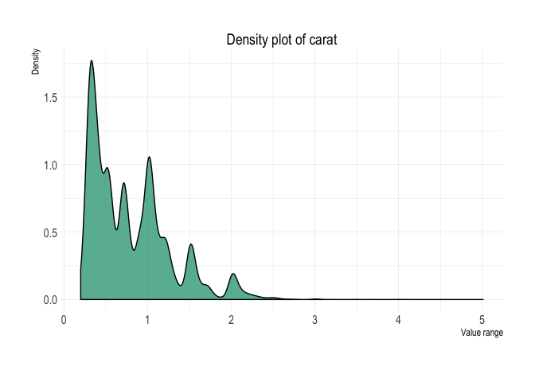
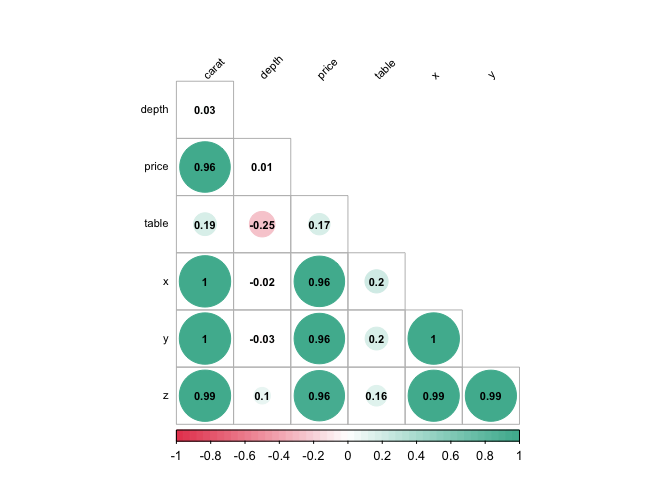
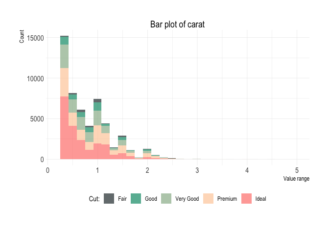
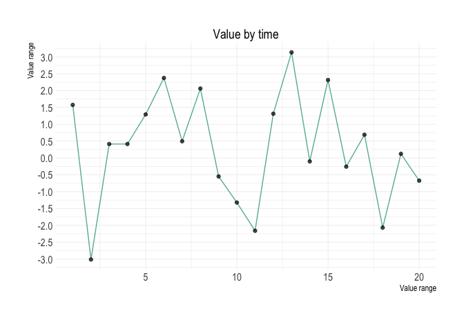
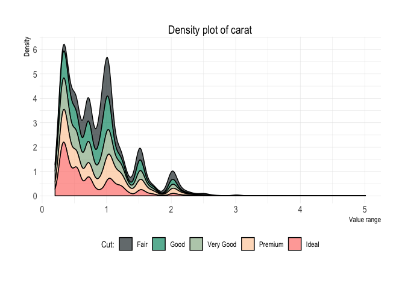
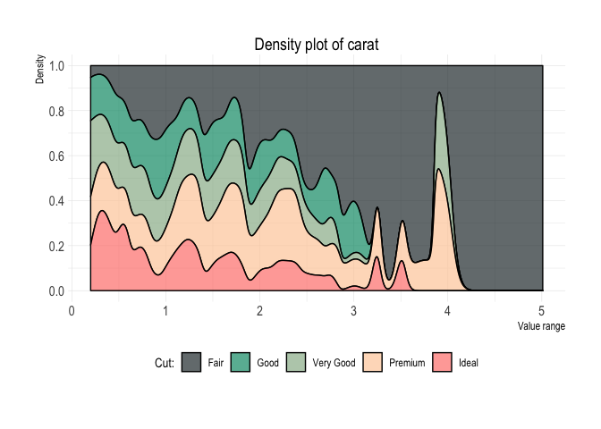
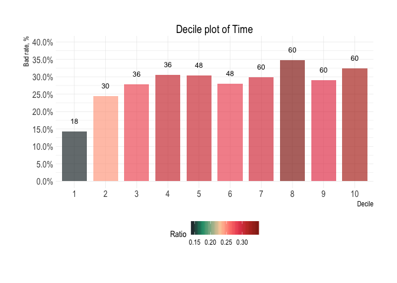
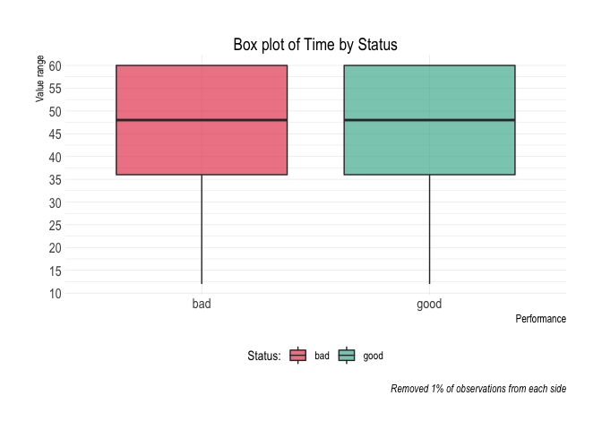

<!-- README.md is generated from README.Rmd. Please edit that file -->

# ggrapid: Create neat & complete ggplot visualizations with as little code as possible

ggrapid enables creation of the most common ggplot-based visualizations
fast and with just a few lines of code. ggrapid comes handy when you’d
like to do an initial and quick EDA over various columns of your dataset
programatically, without the need of writing a lot of custom ggplot
code.

## Installation

``` r
# Install development version from GitHub
devtools::install_github("konradsemsch/ggrapid")
```

## Main functions

ggrapid offers a couple wrappers around the most commonly used functions
in the course of doing an EDA:

  - `plot_density`
  - `plot_boxplot`
  - `plot_deciles` (with `calculate_decile_table`)
  - `plot_correlation`
  - `plot_bars`
  - `plot_line`

#### Density plot

``` r
diamonds %>%
  plot_density(x = carat)
```

<!-- -->

#### Box-plot

``` r
diamonds %>%
  plot_boxplot(x = cut,
               y = carat)
```

<!-- -->

#### Decile plot

``` r
diamonds %>% 
  filter(cut %in% c("Ideal", "Premium")) %>% 
  calculate_decile_table(price, cut, "Ideal") %>%
  plot_deciles()
```

<!-- -->

#### Correlation

``` r
diamonds %>%
  plot_correlation()
```

<!-- -->

#### Barplot

``` r
diamonds %>%
  plot_bars(x = carat,
            x_type = "num",
            fill = cut)
```

<!-- -->

#### Lineplot

``` r
tibble(
  time = 1:20,
  value = rnorm(20, 0.5, 2)
  ) %>%
  plot_line(
    x = time,
    y = value
  )
```

<!-- -->

## Main arguments

The most commonly implemented ggplot2 arguments across all main ggrapid
functions ensure that you can build your basic EDA file without making
additional changes or custom functions. Those arguments are mainly
(might slightly differ across functions):

  - fill
  - facet
  - position
  - ticks
  - angle
  - title
  - subtitle
  - caption
  - lab\_x
  - lab\_y
  - legend
  - vline/ hline
  - alpha
  - quantile\_low
  - quantile\_high
  - theme\_type
  - palette

<!-- end list -->

``` r
diamonds %>%
  plot_density(x = carat)
```

<!-- -->

``` r
diamonds %>%
  plot_density(x = carat,
               fill = cut,
               position = "stack")
```

<!-- -->

``` r
diamonds %>%
  plot_density(x = carat,
               fill = cut,
               position = "fill")
```

<!-- -->

``` r
diamonds %>%
  plot_density(x = carat,
               fill = cut,
               facet = cut,
               title = "Write your title here",
               subtitle = "Write your subtitle here",
               caption = "Write your caption here",
               lab_x = "Carat",
               alpha = .5,
               vline = 1)
```

<!-- -->

## Complete usage

You can easily iterate across selected columns and create a set of plots
for your EDA file:

``` r

library(recipes)

credit_data_nested <- credit_data %>% 
  select(-one_of("Home", "Marital", "Records", "Job")) %>% # removing categorical variables
  gather(variable, variable_value,
         one_of("Seniority", "Time", "Age", "Expenses", # selecting variables to gather
                "Income", "Assets", "Debt", "Amount", "Price")) %>% 
  nest(-variable) %>% 
  mutate(
    decile_table = map(data, 
                       ~calculate_decile_table(
                         .x,
                         binning = variable_value,
                         grouping = Status,
                         top_level = "bad",
                         format = FALSE
                         )
    ),
    plot_deciles  = pmap(list(x = decile_table, y = variable),
                         ~plot_deciles(
                           .x,
                           title = glue::glue("Decile plot of {.y}"),
                           quantile_low = 0, 
                           quantile_high = 1, 
                           lab_x = "Decile",
                           lab_y = "Bad rate, %"
                           )
    ),
    plot_boxplot  = pmap(list(x = data, y = variable),
                         ~plot_boxplot(
                           .x,
                           x = Status,
                           y = variable_value,
                           fill = Status,
                           title = glue::glue("Box plot of {.y} by Status"),
                           quantile_low = 0.01,
                           quantile_high = 0.99,
                           lab_x = "Performance",
                           caption = "Removed 1% of observations from each side"
                           )
    ),
    plot_density  = pmap(list(x = data, y = variable),
                     ~plot_density(
                       .x,
                       x = variable_value,
                       fill = Status,
                       title = glue::glue("Box plot of {.y} by Status"),
                       quantile_low = 0.01,
                       quantile_high = 0.99,
                       lab_x = "Performance",
                       caption = "Removed 1% of observations from each side"
                       )
    )
  )
```

This will give you the following structure, where each row represents an
individual variable and columns are the different plots you would like
to inspect:

``` r
credit_data_nested[1:3, ]
#> # A tibble: 3 x 6
#>   variable  data       decile_table  plot_deciles plot_boxplot plot_density
#>   <chr>     <list>     <list>        <list>       <list>       <list>      
#> 1 Seniority <tibble [… <tibble [10 … <gg>         <gg>         <gg>        
#> 2 Time      <tibble [… <tibble [10 … <gg>         <gg>         <gg>        
#> 3 Age       <tibble [… <tibble [10 … <gg>         <gg>         <gg>
```

## Exemplary EDA format

Then creating a standardised EDA file is just as easy as doing something
like this:

### Variable: Seniority

#### Decile analysis

``` r
credit_data_nested$decile_table[[1]]
#> # A tibble: 10 x 8
#>    decile   min median   max top_level total bottom_level ratio
#>    <fct>  <dbl>  <dbl> <dbl>     <int> <int>        <int> <dbl>
#>  1 1          0      0     0       235   446          211 0.527
#>  2 2          0      1     1       209   445          236 0.470
#>  3 3          1      2     2       174   446          272 0.390
#>  4 4          2      3     3       146   445          299 0.328
#>  5 5          3      4     5       122   445          323 0.274
#>  6 6          5      6     8       105   446          341 0.235
#>  7 7          8     10    10        88   445          357 0.198
#>  8 8         10     12    14        76   446          370 0.170
#>  9 9         14     16    20        54   445          391 0.121
#> 10 10        20     25    48        45   445          400 0.101
```

``` r
credit_data_nested$plot_deciles[[1]]
```

<!-- -->

#### Aditional plots

``` r
credit_data_nested$plot_boxplot[[1]]
```

<!-- -->

``` r
credit_data_nested$plot_density[[1]]
```

<!-- -->

### Variable: Time

#### Decile analysis

``` r
credit_data_nested$decile_table[[2]]
#> # A tibble: 10 x 8
#>    decile   min median   max top_level total bottom_level ratio
#>    <fct>  <dbl>  <dbl> <dbl>     <int> <int>        <int> <dbl>
#>  1 1          6     18    24        64   446          382 0.143
#>  2 2         24     30    36       109   445          336 0.245
#>  3 3         36     36    36       124   446          322 0.278
#>  4 4         36     36    48       136   445          309 0.306
#>  5 5         48     48    48       135   445          310 0.303
#>  6 6         48     48    60       125   446          321 0.280
#>  7 7         60     60    60       133   445          312 0.299
#>  8 8         60     60    60       155   446          291 0.348
#>  9 9         60     60    60       129   445          316 0.290
#> 10 10        60     60    72       144   445          301 0.324
```

``` r
credit_data_nested$plot_deciles[[2]]
```

<!-- -->

#### Aditional plots

``` r
credit_data_nested$plot_boxplot[[2]]
```

<!-- -->

``` r
credit_data_nested$plot_density[[2]]
```

<!-- -->
